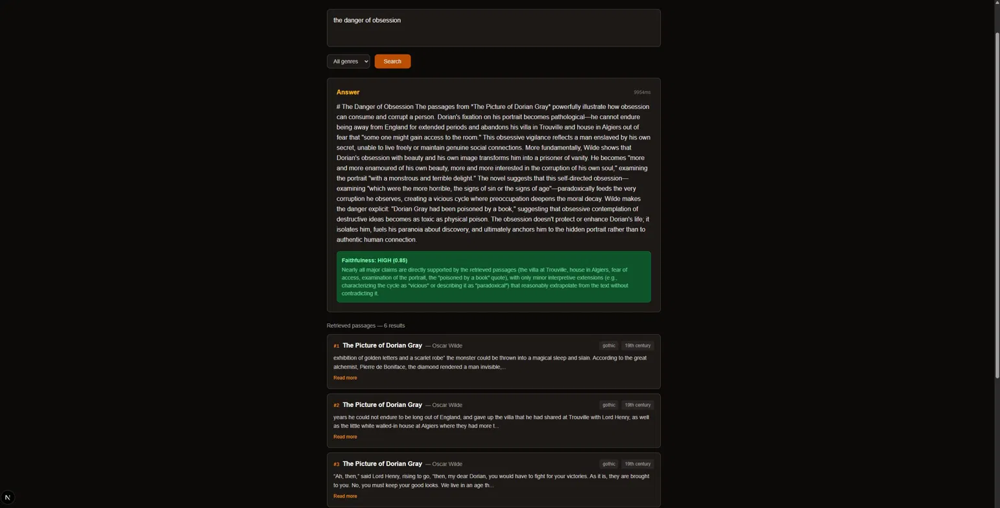

# Librarian — RAG-Powered Semantic Search Engine

Semantic search and Q&A over classic literature using Anthropic's Contextual Retrieval, hybrid search, and faithfulness evaluation.



---

## The Problem

Naive RAG chunks documents without context — a chunk saying *"he felt the walls closing in"* loses all reference to who and why. Librarian fixes this using Anthropic's Contextual Retrieval: Claude enriches each chunk with a document-aware summary before embedding, making retrieval significantly more accurate.

---

## Features

- **Contextual Retrieval** — Claude-enriched chunks before embedding, solving the context-loss failure mode in naive RAG
- **Hybrid Search** — BM25 + vector similarity merged and reranked with a cross-encoder for higher precision
- **Faithfulness Scoring** — second Claude call detects hallucinations, surfaced as a High / Medium / Low confidence badge in the UI
- **Metadata Filtering** — filter results by genre, era, or author
- **676 chunks** indexed across 4 classic works

---

## Tech Stack

`Python` `FastAPI` `Claude API` `ChromaDB` `sentence-transformers` `rank-bm25` `cross-encoder` `Next.js` `Tailwind CSS`

---

## Architecture

```
User Query
    ↓
Hybrid Search (BM25 + Vector Similarity)
    ↓
Cross-Encoder Reranking
    ↓
Claude Generation (grounded in retrieved passages)
    ↓
Faithfulness Check (hallucination detection)
    ↓
Answer + Confidence Badge

```
---

## Project Structure


librarian/
├── backend/
│   ├── ingestion/
│   │   ├── downloader.py     # Fetches books from Project Gutenberg
│   │   ├── chunker.py        # Chunks + enriches with Claude (Contextual Retrieval)
│   │   └── embedder.py       # Embeds and stores in ChromaDB
│   ├── retrieval/
│   │   └── retriever.py      # Hybrid BM25 + vector search + reranking
│   ├── generation/
│   │   └── generator.py      # Claude generation + faithfulness check
│   └── api/
│       └── main.py           # FastAPI endpoints
├── frontend/                 # Next.js UI
├── assets/
│   └── demo.png              # Demo screenshot
└── requirements.txt


---

## Quickstart

```bash
git clone https://github.com/simhasri/librarian.git
cd librarian
py -m venv venv && venv\Scripts\activate
pip install -r requirements.txt
```

Add your `ANTHROPIC_API_KEY` to `.env`:
```
ANTHROPIC_API_KEY=your_key_here
```

Then run the ingestion pipeline:
```bash
py backend/ingestion/downloader.py
py backend/ingestion/chunker.py
py backend/ingestion/embedder.py
```

Start the backend:
```bash
py -m uvicorn backend.api.main:app --reload
```

Start the frontend:
```bash
cd frontend
npm install
npm run dev
```

Visit `http://localhost:3000` — API docs at `http://localhost:8000/docs`

---

## API Endpoints

| Method | Endpoint | Description |
|--------|----------|-------------|
| GET | `/health` | Health check |
| GET | `/stats` | Collection stats |
| POST | `/search` | Hybrid retrieval only (no LLM) |
| POST | `/ask` | Full RAG pipeline with faithfulness scoring |

---

## Corpus

Books sourced from [Project Gutenberg](https://www.gutenberg.org):

- *Pride and Prejudice* — Jane Austen
- *The Picture of Dorian Gray* — Oscar Wilde
- *Alice in Wonderland* — Lewis Carroll
- *A Modest Proposal* — Jonathan Swift

---

## What Makes This Different

Most RAG tutorials embed raw chunks. Librarian uses Anthropic's Contextual Retrieval — Claude prepends a document-aware summary to each chunk before embedding. Combined with hybrid search and a faithfulness checker that scores every answer, this is a production-grade pipeline, not a tutorial project.

---

